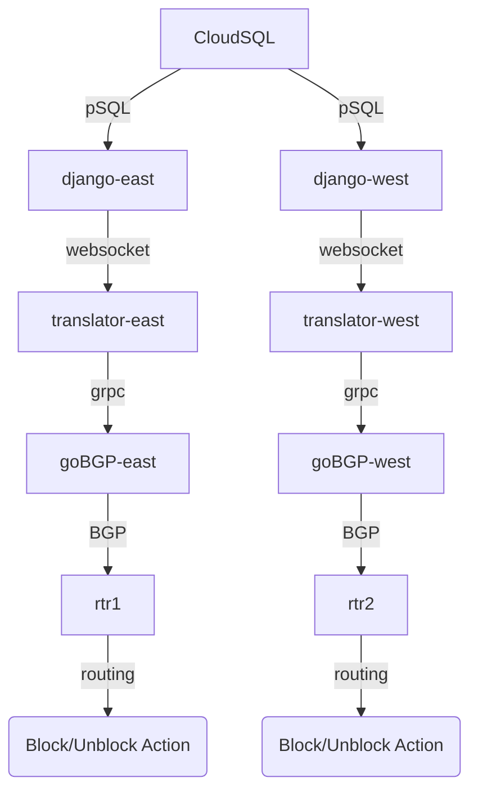

# Components

```mermaid
graph TD;
    CloudSQL -- pSQL --> django-east;
    django-east -- websocket --> translator-east;
    translator-east -- grpc --> goBGP-east;
    goBGP-east -- BGP --> rtr1;
    rtr1 -- routing --> net1("Block/Unblock Action");
    CloudSQL -- pSQL --> django-west;
    django-west -- websocket --> translator-west;
    translator-west -- grpc --> goBGP-west;
    goBGP-west -- BGP --> rtr2;
    rtr2 -- routing --> net2("Block/Unblock Action");
```

# Local Failures

