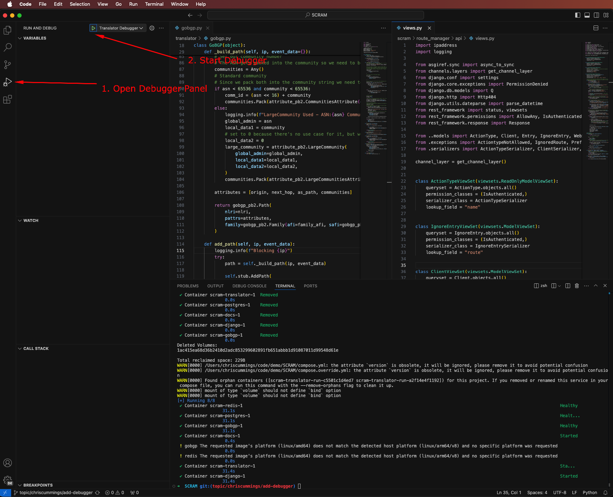
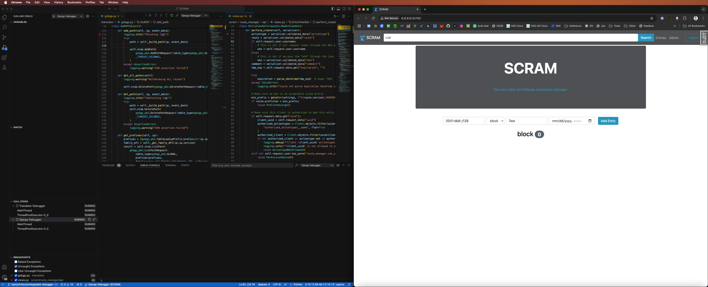
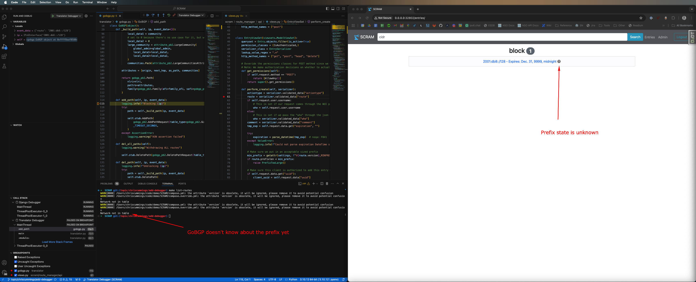
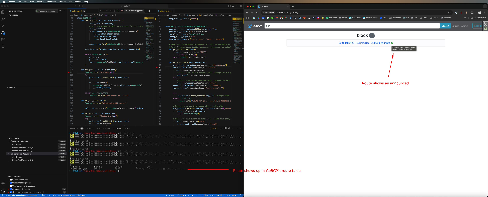
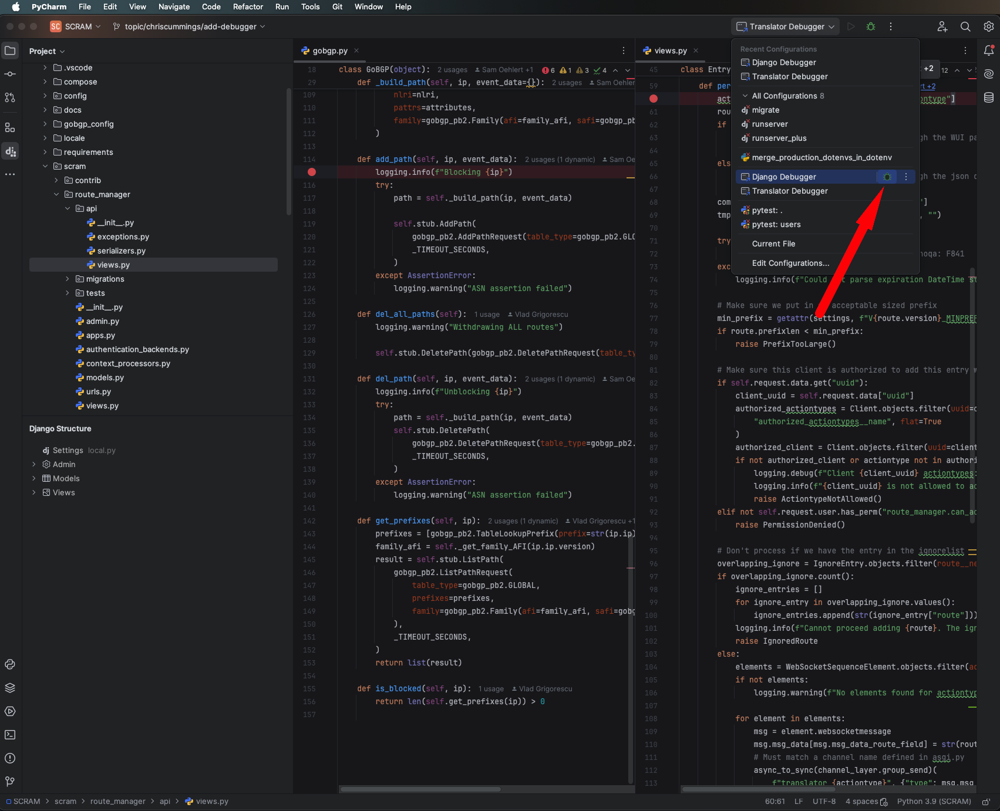
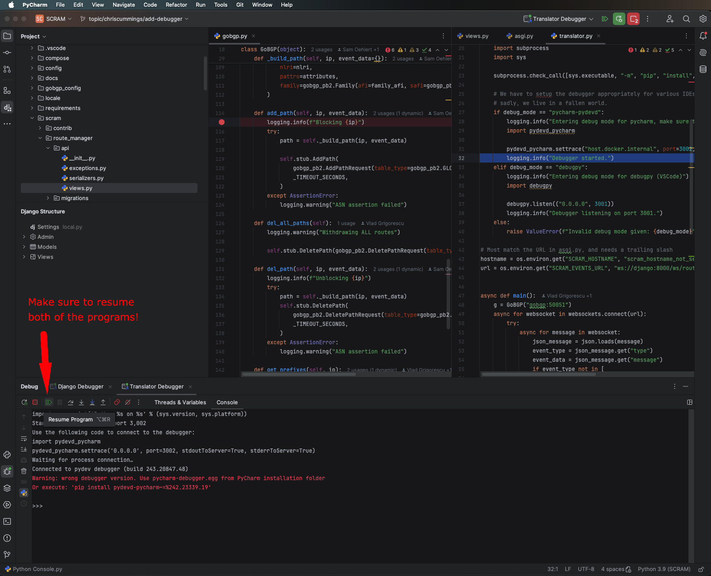
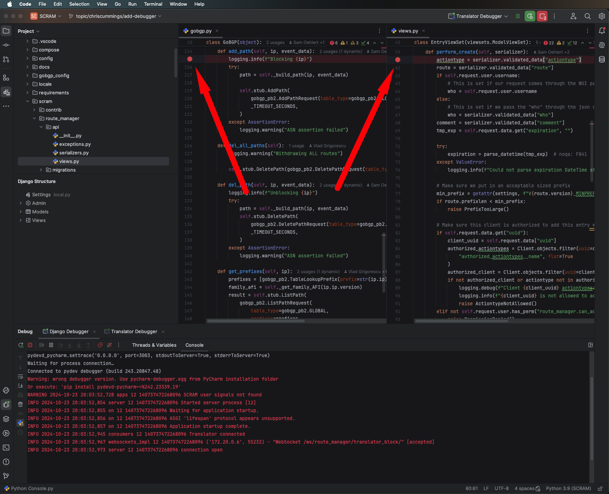
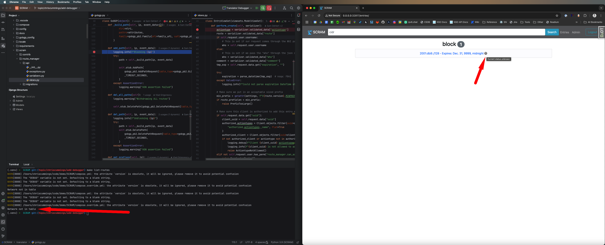
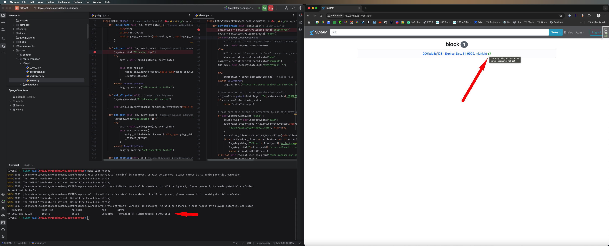

# Development Guide

## Technology Explainer

This project is based off of [this cookiecutter](https://github.com/cookiecutter/cookiecutter-django), which is based off of the book [Two Scoops of Django](https://www.feldroy.com/books/two-scoops-of-django-3-x). This book provides an opinionated take on Django. If you are working on this project, and stuck on the "how" for a given situation, your first step should be to see if the book has a suggestion.

The last two could theoretically be pulled out and run separately from the rest of this stack, but for the time being, we are running them all on the same host(s).

### Styling

We strive to follow [pep8](https://peps.python.org/pep-0008/) in almost all cases. See setup.cfg for the instances in which we differ.

### Working with Git

We use git as our VCS and the main repo is stored on ESnet's [gitlab instance](https://gitlab.es.net/security/scram). We utilize a git-flow branching strategy on this project. For more information on what this means, please see [this reference](https://www.gitkraken.com/learn/git/git-flow).

## Expected Development Patterns

Changes are expected to be created and tested fully locally using docker. This should give a higher level of confidence in changes, as well as speed up the development cycle as you can immediately test things locally. Theoretically we can run either the local or production version (no SSL) on our development workstations. Production will mirror that of a true production instance (minus SSL), whereas local runs with more debugging options and no web server since the dev version of django can serve all we need.

Accepted branch naming examples:

* `topic/soehlert/add_docs-sec-123` (the sec-123 represents a jira ticket number)
* `topic/soehlert/update_docs` (if there is no related jira ticket)
* `hotfix/broken_thing`

1. Clone this repo
2. Branch off of the appropriate protected branch (likely develop)
   1. `git checkout develop`
   2. `git checkout -b topic/$name/$feature`
3. Run migrations (MUST DO FIRST TIME) `make migrate`
4. Choose if you want local or prod `make toggle-local` or `make toggle-prod`
5. Build the stack if you haven't before (or you've done a clean) `make build`
6. Run the stack `make run`
7. Open the site `make django-open`
8. Make your changes and it should auto reload
9. Make sure to add or update tests

## Testing

We should be testing as much as we reasonably can. Currently, there is a mix of [behave-django](https://behave-django.readthedocs.io/en/stable/) and pytest.
If you are unsure which of the two to use, please feel free to ask.

* To run all behave tests `make behave-all`
* To run a specific set of behave tests `make behave FEATURE=$feature-name`
* To run behave tests on translator `make behave-translator`
* To run pytests `make pytest`
* To run all tests you would have in gitlabCI `make ci-test`

Ideally we would never have failing tests getting merged, so clearing up the `make ci-test` before a merge request is suggested.

### Debugging Tests

If you are seeing failed API calls, you can try to browse the API directly in a web browser. You can also try to run some curl commands.
You will need to create and authorize a client before you can make any API calls to affect change.

* To create a UUID for use with a client you can use python in an interactive terminal:

    ```python
    import uuid
    print(str(uuid.uuid4()))
    ```

* To create a client
    1. Make sure you know the admin user password for basic auth `make pass-reset`
    2. `make django-open`
    3. Log into admin site
    4. Create a client using the uuid you made in the last step

* Use curl with basic auth and json content type header
    1. Get the correct port `make django-url`
    2. Replace with the correct port `curl -XPOST http://0.0.0.0:62410/api/v1/entrys/ -H 'Content-Type: application/json'
       --data '{"route": "1.1.1.1/32", "actiontype": "block", "comment": "testing", "uuid": "UUID GOES HERE"}'; echo`

Trying to write test output to a file is a challenge due to running in ephemeral docker containers, but you should be able to print to stderr to get some debug info as needed as well.

## Troubleshooting

There are a few troubleshooting tricks available to you.

* Run with `make toggle-local` as this will turn on debug mode in django
* To see if your blocks are making it into GoBGP you can run `make list-routes`
* If you want container logs `make tail-log CONTAINER=$service-name`

## Interactive Debugger

All of the python applications that are part of SCRAM are setup to work with a variety of interactive debuggers. This can prove quite useful when developing a new feature, tracing down a bug, or just trying to learn how data flows through the application. When running SCRAM in `local` mode, this is enabled by setting up the `DEBUG` environment variable on your system. Because various IDEs have their own approaches to debugging an application, below are the instructions on how to set things up so you can debug.

### VSCode and debugpy

To debug SCRAM with VSCode, you simply need to set an environment variable on your machine that sets `DEBUG` to `debugpy` and then you'll need to recreate your SCRAM containers. For example, on zsh, you would run `export DEBUG=debugpy && make clean && make run` and the application stack will start up ready to be connected to with your debugger.

Now that the debugpy server is running, using VScode, navigate to the debugger tab and start both the django and translator debugging sessions as shown in the image below:



> _**Note:**_ VSCode might prompt you to install the `Python Debugger` Extension if you don't have this installed already. Additionally, make sure you are opening the remote debugger session that connects to the containers running the SCRAM code. VSCode can also run a debugger against the file you have open, however, this won't work in an application like SCRAM.

Once both debuggers are connected, you should see them listed in the call portion of the debugger tray. Now you're ready to actually debug the application. To do this, you'll typically want to start setting breakpoints where you want to inspect the code as it runs. In this example, we'll debug entering a block into SCRAM and we'll debug the stack by setting breakpoints on the first lines within `scram/route_manager_api/views.py:perform_create` and `translator/gobgp.py:add_path`. You can see the breakpoints represented by the red dots in the below screenshot:



Using this example, you can add a block for the address `2001:db8::/128` to the web UI and see it as it hits the breakpoint in `views.py` and you step over to the line that extracts the route. From here you can inspect the route variable and even make changes to it! Here is what you should see in VSCode:


When we continue to the next breakpoint, we are brought to the breakpoint added in the translator's `add_path()` function for GoBGP, and we can see that it's the same value that went through django. Again, we could change the values here if we wanted to, and we can also interact with the python REPL for further debugging. Since the application is currently paused and waiting for us to continue, you can see that the block entry shows up in the web UI, but it's status is unknown. By running `make list-routes, we can also see that GoBGP has not yet received the instructions to announce the prefix:



Once we hit continue on the debugger, since we have no more breakpoints, the block will be completed, and we'll see that it's being announced properly:



For more detailed information on how to use the VSCode debugger, read [this article.](https://code.visualstudio.com/docs/editor/debugging)

## PyCharm and pycharm-pydevd

To debug SCRAM with PyCharm, you first need to ensure that the debugger servers are running in PyCharm. PyCharm uses `pydevd` which works the opposite of `debugpy`, such that the server lives in your IDE, and your code connects out to the IDE for the debugger connection. To start the debugger server in PyCharm, you simply need to choose the two debugger profiles that are already checked in to this repository and start them, as shown here:



> **NOTE:** Ensure that you start both the django and the translator debugger servers!

Once both servers are started in PyCharm, you simply need to set an environment variable on your machine that sets `DEBUG` to `pycharm-pydevd` and then you'll need to recreate your SCRAM containers. For example, on zsh, you would run `export DEBUG=pycharm-pydevd && make clean && make run` and the application stack will start up and be connect to your debugger. The pycharm debugger by default pauses the application once the debugger connects, so you'll need to manually resume the code by clicking the `Resume` button for both the django and the translator containers, like so:



> **NOTE:** Once the application connects to the debugger, you will see the folling warning in the debugger console:
>```text
>Warning: wrong debugger version. Use pycharm-debugger.egg from PyCharm installation folder
>Or execute: 'pip install pydevd-pycharm~=%242.23339.19'
>```
> This is because we use an unpinned version of `pycharm-pydevd` for flexibility. If you run into issues, pin the dependency to the version you need in both `translator/requirements/local.txt` and `requirements/local.txt` and rebuild the entire stack.

Now that the debugger is connected, you're ready to actually debug the application. To do this, you'll typically want to start setting breakpoints where you want to inspect the code as it runs. In this example, we'll debug entering a block into SCRAM and we'll debug the stack by setting breakpoints on the first lines within `scram/route_manager_api/views.py:perform_create` and `translator/gobgp.py:add_path`. You can see the breakpoints represented by the red dots in the below screenshot:



Using this example, you can add a block for the address `2001:db8::/128` to the web UI and see it as it hits the breakpoint in `views.py` and you step over to the line that extracts the route. From here you can inspect the route variable in the `Threads & Variables` tab and even make changes to it! Here is what you should see in PyCharm:


When we continue to the next breakpoint, we are brought to the breakpoint added in the translator's `add_path()` function for GoBGP, and we can see that it's the same value that went through django. Again, we could change the values here if we wanted to, and we can also interact with the python REPL for further debugging. Since the application is currently paused and waiting for us to continue, you can see that the block entry shows up in the web UI, but it's status is unknown. By running `make list-routes, we can also see that GoBGP has not yet received the instructions to announce the prefix:



Once we hit continue on the debugger, since we have no more breakpoints, the block will be completed, and we'll see that it's being announced properly:



For more detailed information on how to use the PyCharm debugger, read [this article.](https://www.jetbrains.com/guide/python/tutorials/getting-started-pycharm/basic-code-debugging/)

## Turning off Debugging

To turn off debugging for either application, you simply need to remove the variable `DEBUG` and relaunch SCRAM. Using `zsh` as an example, you would simply run `unset DEBUG && make clean && make run`.

## Debugging Debugging

Like all complicated things, running a remote debugger in this manner can sometimes be finicky. Some common scenarios you might run into are listed below:

* Starting the wrong debugger for the application you're trying to debug with
  * Make sure that you are using `debugpy` with VSCode and `pycharm-pydevd` with PyCharm!
* Not being able to connect from VSCode to the applications with the debugger
  * Make sure that you can see that the debugger has started by looking at the container logs with `make tail-log`. Here you should see a message along the lines of `Translator is set to use a debugger. Provided debug mode: debugpy` or `Django is set to use a debugger. Provided debug mode: debugpy`. This will of course vary upon which app you're looking at and which debug mode you're using.
* Not being able to connect with PyCharm.
  * Because the PyCharm debugger requires a connection from the application to PyCharm, we have to rely on the existence of the `host.docker.internal` DNS entry being available to the application. This is provided by default with colima and Docker Desktop, however, using docker-engine on linux does not provide this, so you might need to manually add this to your container using the `extra_hosts` option in docker compose.
* Applications failing to start with the error `ValueError: Invalid debug mode given:`
  * You will see this error if you set your environment variable for `DEBUG` to anything other than `debugpy` or `pycharm-pydevd`.
